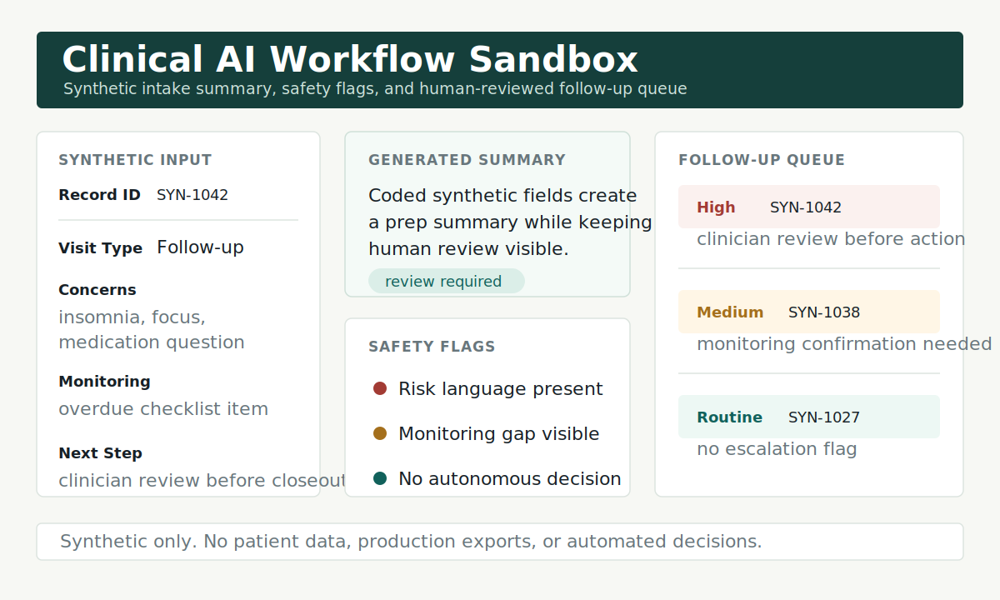

# Clinical AI Workflow Sandbox

[](https://github.com/MichaelRDionne/clinical-ai-workflow-sandbox/actions/workflows/tests.yml)

Synthetic clinical workflow demo for intake summarization, longitudinal snapshots, follow-up queueing, and safety checks.

This repository is designed as a public portfolio project. It demonstrates how I think about clinical AI systems: reduce cognitive load, keep humans in control, make uncertainty visible, and keep sensitive data out of public demos.



The visual demo shows the intended workflow shape: structured synthetic input, generated summary, visible safety flags, and a queue that routes uncertainty back to human review.

## Demo Preview

- Visual: `assets/clinical-workflow-demo.svg`
- Captured run: `examples/demo-output.txt`
- Deeper walkthrough: `docs/case-study-intake-to-review-queue.md`

## What It Shows

- Synthetic patient fixtures with coded IDs only.
- Intake summary generation from structured inputs.
- Longitudinal snapshot generation for follow-up prep.
- Follow-up queue generation by risk and due date.
- Safety checks for missing monitoring, escalation flags, and human review.
- Expected-output evaluation fixtures for synthetic summaries.

## Recruiter Quick Scan

This is a small but complete demonstration of how I approach clinical AI workflow design. It is not trying to be a production EHR integration. It shows the parts I care about most: structured inputs, summary generation, explicit risk flags, and review-before-action guardrails.

Why it matters: clinical AI tools are easy to demo badly. A useful system has to make missing information visible, route uncertainty to a human, and avoid pretending that a generated summary is a clinical decision.

## Safety Boundary

This repo contains no real patient data and no production clinical exports. Every example is synthetic and simplified for demonstration. It is not medical advice, not a diagnostic system, and not intended for direct clinical use.

See `DATA_BOUNDARY.md` for the public-data rules used for this sandbox.

## Run The Demo

```bash
python3 examples/run_demo.py
```

Run the expected-summary evaluation:

```bash
python3 examples/run_summary_evaluation.py
```

Expected output:

- A brief intake summary.
- A longitudinal follow-up snapshot.
- A prioritized follow-up queue.
- Safety flags that require human review.

See `examples/demo-output.txt` for a captured example run.

See `examples/summary-evaluation-output.txt` for a captured evaluation run.

See `docs/scenario-walkthrough.md` and `docs/case-study-intake-to-review-queue.md` for recruiter-friendly explanations of what the workflow is modeling and where the automation boundary stops.

See `docs/summary-evaluation.md` for the expected-output fixture approach used to test summary behavior.

## Run Tests

```bash
python3 -m unittest discover -s tests
```

## Project Structure

```text
synthetic-data/patient-fixtures.json  synthetic demo records
synthetic-data/expected-summary-fixtures.json  summary evaluation fixtures
src/clinical_workflow.py              summary, queue, and safety logic
src/summary_evaluation.py             expected-output evaluation helper
examples/run_demo.py                  runnable demo
examples/run_summary_evaluation.py    runnable evaluation demo
tests/test_clinical_workflow.py       guardrail and priority tests
tests/test_summary_evaluation.py      summary expectation tests
DATA_BOUNDARY.md                      public data and safety rules
```

## Design Principles

- Synthetic data first.
- Human review before action.
- Clear escalation language.
- Minimal automation until the workflow is understood.
- Outputs should explain what they used and what they did not know.

## Next Build Ideas

- Add a synthetic CSV import path.
- Add a Streamlit dashboard view for follow-up queues.
- Expand the summary evaluation rubric for uncertainty, usefulness, and escalation handling.
